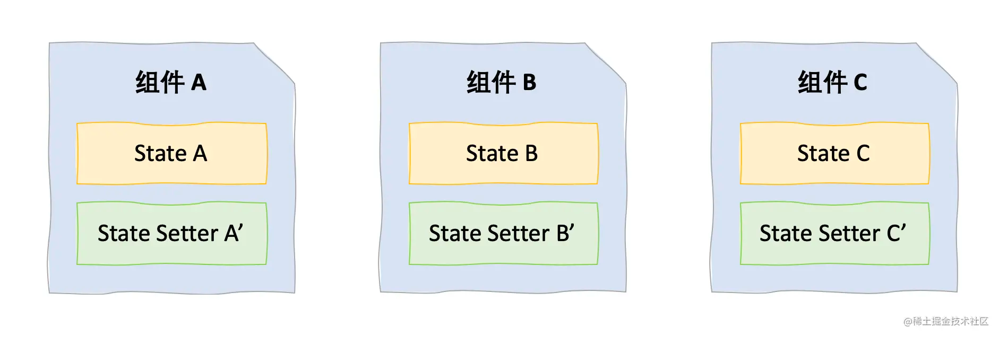

# 什么是reducer
js中的reduce函数，接受两个参数第一个是reducer函数，第二个是初始值，reducer函数有两个特点
+ 只返回一个值
+ 不改变原值，返回新值

区别一下两个reducer：

不是 Reducer 函数
```js
function bug(cart, thing) {
	cart.push(thing)
  return cart
}
```
正宗的 Reducer 函数
```js
function bug(cart, thing) {
	
  return cart.concat(thing)
}
```

# useState和useReducer关系

useState底层使用了useReducer
```js
function basicStateReducer(state, action) {
  return typeof action === 'function' ? action(state) : action;
}
```
当我们通过`setCount(prevCount => prevCount + 1)`改变状态时，传入的action就是一个reducer函数，然后传入当前的state,并且调用action函数，但我们通过`setCount(55)`改变状态时，传入的
action就是55，所以直接取传入的值作为更新后的值

# 举例

我们的数据和setter都放在了组件中，跨组件的状态读取和修改都是非常麻烦的，因此我们可以借助reducer和context解决该问题

# useReducer + useContext
使用  `useReducer + useContext` 实现一个轻量的redux

## Redux 基本思想

数据统一管理放在store中，各个组件通过dispatch派发事件，调用reducer改变store中的数据，然后更新视图

## useReducer

使用方法：
```
const [state, dispatch] = useReducer(reducer, initialArg, init);
```
+ reducer和redux中的reducer类似，`(state, action) => newState`
+ initialArg：初始状态值
+ init 是一个可选的用于懒初始化（Lazy Initialization）的函数，这个函数返回初始化后的状态

## 什么时候用useReducer
但我们遇到以下问题时：
+ 状态比较复杂，多个状态互相依赖
+ 修改状态的过程比较复杂

我们可以考虑使用useReducer，否则使用useState比较友好

## useContext
状态的获取和修改都已经完成了，那么我们如何让所有的组件都获取到dispatch呢

在hooks之前，React提供了context，在类组件中可以通过`Class.contextType`获取最近的context，那么在函数组件中，我们如何获取呢，如下
```js
// 在某个文件中定义 MyContext
const myHello = React.createContext('hello')
// 在函数式组件中获取 Context
function component () {
	const value = useContext(myHello)
}
```
## 举例
### 根组件
```js

// src/App.js
import React, { useReducer } from "react";

// ...

const initialState = {
  key: "cases",
  country: null,
  lastDays: {
    cases: 30,
    deaths: 30,
    recovered: 30,
  },
};

function reducer(state, action) {
  switch (action.type) {
    case "SET_KEY":
      return { ...state, key: action.key };
    case "SET_COUNTRY":
      return { ...state, country: action.country };
    case "SET_LASTDAYS":
      return {
        ...state,
        lastDays: { ...state.lastDays, [action.key]: action.days },
      };
    default:
      return state;
  }
}

// 用于传递 dispatch 的 React Context
export const AppDispatch = React.createContext(null);

function App() {
  const [state, dispatch] = useReducer(reducer, initialState);
  const { key, country, lastDays } = state;

  const globalStats = useCoronaAPI("/all", {
    initialData: {},
    refetchInterval: 5000,
  });

  const countries = useCoronaAPI(`/countries?sort=${key}`, {
    initialData: [],
    converter: (data) => data.slice(0, 10),
  });

  const history = useCoronaAPI(`/historical/${country}`, {
    initialData: {},
    converter: (data) => data.timeline,
  });

  return (
    <AppDispatch.Provider value={dispatch}>
      <div className='App'>
        <h1>COVID-19</h1>
        <GlobalStats stats={globalStats} />
        <SelectDataKey />
        <CountriesChart data={countries} dataKey={key} />

        {country ? (
          <>
            <h2>History for {country}</h2>
            <HistoryChartGroup history={history} lastDays={lastDays} />
          </>
        ) : (
          <h2>Click on a country to show its history.</h2>
        )}
      </div>
    </AppDispatch.Provider>
  );
}

export default App;
```
+ 定义了 AppDispatch 这个 Context，用来向子组件传递 dispatch
+ 在渲染时用 AppDispatch.Provider 将整个应用包裹起来，传入 dispatch ，使子组件都能获取得到
## 在子组件中通过 Dispatch 修改状态

+ 通过useContext获取dispatch
+ 使用dispatch触发action

子组件1：
```js
// src/components/CountriesChart.js
import React, { useContext } from "react";
// ...
import { AppDispatch } from "../App";

function CountriesChart({ data, dataKey }) {
  const dispatch = useContext(AppDispatch);

  function onClick(payload = {}) {
    if (payload.activeLabel) {
      dispatch({ type: "SET_COUNTRY", country: payload.activeLabel });
    }
  }

  return (
    // ...
  );
}

export default CountriesChart;
```
子组件2：
```jsx
// src/components/HistoryChartGroup.js
import React, { useContext } from "react";

import HistoryChart from "./HistoryChart";
import { transformHistory } from "../utils";
import { AppDispatch } from "../App";

function HistoryChartGroup({ history = {}, lastDays = {} }) {
  const dispatch = useContext(AppDispatch);

  function handleLastDaysChange(e, key) {
    dispatch({ type: "SET_LASTDAYS", key, days: e.target.value });
  }

  return (
    // ...
  );
}

export default HistoryChartGroup;
```
