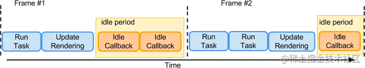

# 为什么要自定义事件机制？
1. 为了磨平差异
2. 为了统一管理
3. 为了简化开发难度，提高开发效率

# class component
## 生命周期
1. 初始化阶段
    + 可以修改state,不会执行更新阶段的生命周期
2. 挂载阶段
    + componentWillMount:还没有挂载 Dom
    + render
    + componentDidMount:已经挂载 Dom
3. 更新阶段
    + componentWillReceiveProps(nextProps,nextState): 当props变更时触发
    + shouldComponentUpdate(nextProps,nextState):判断是否需要更新渲染组件,优化 react 应用的主要手段之一，当返回 false 就不会再向下执行生命周期了，在这个阶段不可以 setState()，会导致循环调用
    + componentWillUpdate(nextProps,nextState):处理一些在 Dom 发生更新之前的事情，如获得 Dom 更新前某些元素的坐标、大小等，在这个阶段不可以 setState()，会导致循环调用
    + render:
    + componentDidUpdate(prevProps,prevState):Dom 已经发生变化，state 已经发生更新，prevProps、prevState 均为上一个状态的值
4. 卸载阶段
    + componentWillUnmount: 组件卸载之后，通常用来移除定时器，事件等等

在react16中，官方已经建议删除一下三个方法：
```
componentWillMount
componentWillReceiveProps
componentWillUpdate
```
取而代之的是以下两个钩子
```
// 在实例化、props更新、组件状态更新时候会触发
getDerivedStateFromProps(nextProps, nextState)
// 组件更新前触发，可以获取上一个dom的信息，他的返回值会作为componentDidUpdate的第三个参数
getSnapshotBeforeUpdate(prevProps,prevState)
```

### 为什么要替换掉
因为fiber架构的原因，使用新架构，调和会出发多次生命周期钩子，钩子失去了原来的作用

# setState 同步还是异步
setState函数执行本身是同步的，这里的异步是说多个state会合并到一起批量更新，同步还是异步取决于调用环境
+ 如果是合成事件，生命周期钩子则会合并state更新，然后在更新dom
+ 如果是原生事件处理函数、ajax请求回调、定时器回调，则会同步修改dom

这是因为合成事件，生命周期函数在React的调度中，在源码中，有说明如果执行上下文为空则进行同步更新，否则是异步，在合成事件和钩子中都会把当前的上下文赋值为React上下文

# 函数式编程
两个特点：
+ 无副作用：不会修改老数据，只能在新的数据上修改
+ 无状态：输入相同的参数，输出总是相同

意义：
+ 可缓存：相同入参，输出结果一样，可以缓存结果
+ 便于测试：不受其他无关参数影响

# hooks
为什么要有hooks

没有hooks之前，组件复用通过mixin、HOC、render Props，但是都不好维护，且不直观

## useState
`const [state, setState] = useState(initialValue);`
```
const [count, setCount] = useState(0);
```
特点：
+ 每次渲染是相互独立的，也就是说每次渲染的数据、事件是独立的

## useEffect
使用方法：`useEffect(effectFn, deps)`
特点：
+ effectFn执行时机为render之后，不影响渲染
+ effectFn可以返回一个清理函数，清理函数的执行时机为每次执行effectFn之前，清理上一次的cleanUp
+ 组件销毁的时候,运行最后一次的 effect cleanup

### useLayoutEffect
如果要在渲染之前执行一些副作用函数则可以使用这个api`useLayoutEffect(effectFn, deps)`

特点：
+ 执行时机：effectFn执行时机位render之前，影响渲染

### deps
React会在每次渲染后调用effect，deps用来控制是否调用effect，如果本次deps和上次的一样就跳过本次effect，与之前的类组件相比有两个特点
+ 将生命周期钩子componentDidMount componentDidUpdate componentDidUnmount用同一个api处理
+ 逻辑内聚，通过cleanup函数清除无用定时器等等

### 使用技巧：

+ 我们指定deps为空数组，这样effect只在初次渲染的时候执行
+ 通常我们把使用到的state props作为deps

> 不要在循环、条件、嵌套中使用hook：会导致每次hook顺序不一致

### 链表
hook其实就是一个链表,多次调用 useState 生成的 Hook 记录形成了一条链表

所以我们不能在循环 条件语句中使用，会导致链表失效

## useEffect 依赖为空数组与 componentDidMount 区别

useEffect在真是dom更新后才会执行，会造成两次render,有可能会闪屏，
componentDidMount在render之后执行，如果此时调用setData，则会异步的更新页面，只会渲染第二次的值，
useLayoutEffect 会更接近 componentDidMount 的表现，它们都同步执行且会阻碍真实的 DOM 渲染的

## React.forwardRef

父组件获取子组件中的dom

## React Fiber
时间分片

类似于requestIdleCallback,浏览器有60帧，在每一帧里都会执行一下任务：
+ 处理用户输入
+ 执行js
+ 执行requestAnimation
+ 布局
+ 绘制

在执行完以上操作后，如果还有时间就会执行requestIdleCallback的回调，如果没有时间则不执行

Fiber实现了类似于requestIdleCallback的功能，如果有时间就从队列中获取任务，如果没有时间则让出控制权

## React性能优化手段

+ 使用React.memo缓存组件
+ 使用React.useMemo缓存大量计算
+ 使用React.lazy延迟加载组件
+ 使用React.pureComponent或者shouldComponentUpdate避免组件多次渲染，使用memo也可以
+ 避免使用匿名函数：如果非得使用可以配合useCallback解决

## React redux

### store
存储数据的中心

### action
修改state数据的唯一方式

### reducer
响应action直接修改state
[redux栗子](https://codesandbox.io/s/compassionate-shadow-7jruj?file=/src/index.js)
