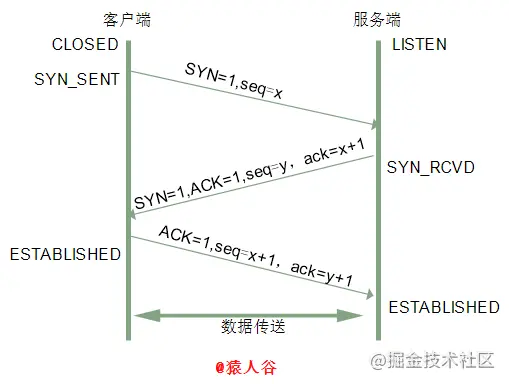
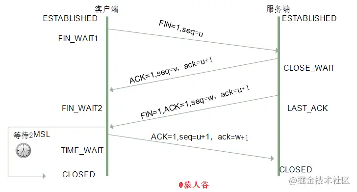

## TCP
### 三次握手
+ 第一次握手：客户端发送SYN包，并携带自己的初始序列号，进入SYN_SENT状态
+ 第二次握手：服务端收到SYN包，发送给客户端自己的SYN包，携带自己的初始化序列号，并且发送ACK包，ack值为对方的初始化序列号+1，表示可以正常接收对方的消息，服务端进入SYN_RCVD状态
+ 第三次握手：客户端收到服务端的SYN包和ACK包，给服务端发送ACK包，ack值为对方的初始化序列号+1，客户端进入established状态，服务端接收到客户端的ACK包后，进入established已连接状态，至此双方进入已连接状态
### 过程

### 为什么需要三次握手
+ 确认双方的发送接收能力正常
+ 把自己的初始化序列号（ISN）告诉对方，便于对方接收消息的时候如何根据序列号拼装数据
### ISN是固定的吗
+ 不是，如果是固定的，容易被攻击者猜出后续的序列号，从而遭到攻击
### 为什么两次握手不可以
防止已丢失的连接请求到达服务端，造成服务端资源的浪费。客户端发起连接请求，但长时间未收到服务端的确认，于是客户端再次向服务端发送连接请求
连接请求成功，并建立连接，数据发送完成后，释放连接，如果此时第一个已丢失的连接到达了服务端，服务端任务是客户端有发起了一个连接请求，由于是两次握手，
服务端进入establish状态，并且发送确认报文给客户端，但客户端此时是closed状态，忽略服务端的报文，而服务端还在等待客户端发送数据，所以会造成服务端资源的浪费
### 什么是半连接队列
服务端接收到客户端的SYN报文后，进入SYN_RCVD状态，这种状态下的连接叫做半连接，服务端会把这种状态下的连接加入到半连接队列，等到三次握手之后，服务端会把
处于连接状态的连接从半连接队列中移除，移入到全连接队列
### 三次握手可以携带数据吗
第一次 第二次不可以，第三次可以  

+ 第一次和第二次如果可以携带数据的话，假设被攻击者利用的话，在syn报文中加入大量数据，需要消耗时间和内存处理数据
+ 第三次客户端已确认服务端的发送和接受是正常的，所以可以发送数据

### dos攻击
客户端模拟大量的不存在的IP，向服务端发起连接请求，服务端会将半连接状态的连接加入到半连接队列，一旦半连接队列溢出的话，那么正常的连接请求 就会被忽略掉，这就是dos攻击

### 四次挥手
+ 第一次：客户端向服务端发送FIN报文，并且携带序列号seq=x，进入FIN_WAIT_1状态
+ 第二次：服务端接收到FIN报文，向客户端发送ACK报文，ack为对方的序列号x+1，进入CLOSE_WAIT状态，客户端接收到确认报文，进入FIN_WAIT_2状态
+ 第三次：服务端向客户端发送FIN报文，并且携带序列号seq=y，进入LAST_ACK状态
+ 第四次：客户端向服务端发送ACK报文，ack为对方的序列号y+1，进入TIME_WAIT状态（等待2MSL），2MSL后未收到服务端的FIN报文则进入close状态，服务端接收到确认报文后，进入CLOSED状态
### 过程

### 为什么需要四次挥手
客户端发送断开请求的时候，服务端需要保证所有的数据都传输完成之后才能断开，所以服务端需要先响应客户端一个确认报文，等到数据传输完成之后在断开连接
### 2MSL是什么
MSL：最长报文存活时间
### 为什么需要等待2MSL时间
为了保证最后一个确认报文到达服务器，假如最后一个确认报文丢失的话，服务端会重新发送一个FIN报文，所以这里的2MSL=ACK报文时间+FIN报文时间
