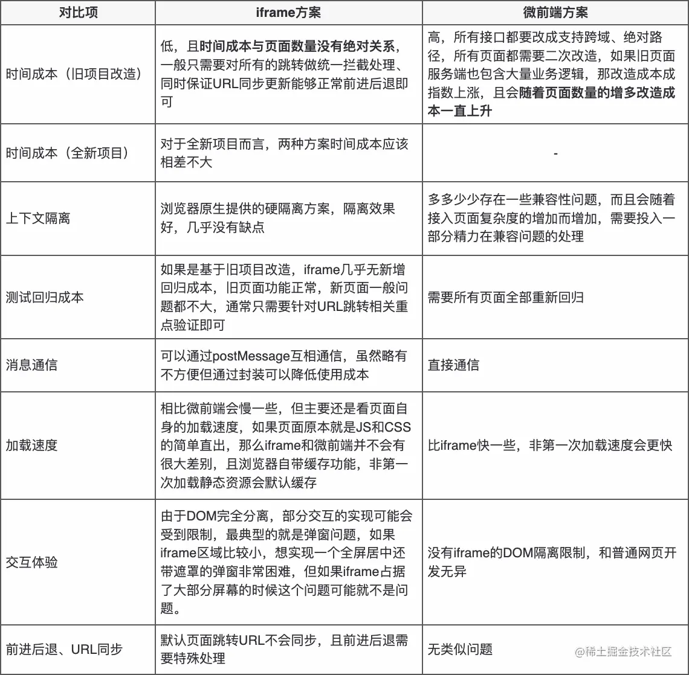

## 乾坤和iframe对比
### qiankun修改成本
+ main.js
```js

let router = null;
let instance = null;

if (window.__POWERED_BY_QIANKUN__) {
  // eslint-disable-next-line
  __webpack_public_path__ = window.__INJECTED_PUBLIC_PATH_BY_QIANKUN__
}

function render(props = {}) {
  const { container } = props;
  router = new VueRouter({
    base: window.__POWERED_BY_QIANKUN__ ? "/sub-app/" : "/", // 抛出路由加前缀
    mode: "history",
    routes
  });

  instance = new Vue({
    router,
    store,
    render: h => h(App)
  }).$mount(container ? container.querySelector("#app") : "#app");
}

if (!window.__POWERED_BY_QIANKUN__) {
  render();
}
export default instance;

export async function bootstrap() {
  console.log("[vue] vue app bootstraped");
}

export async function mount(props) {
  // props 包含主应用传递的参数  也包括为子应用 创建的节点信息
  console.log("[vue] props from main framework", props);
  render(props);
}

export async function unmount() {
  instance.$destroy();
  instance = null;
  router = null;
}
```
+ router.js
```js
// 删除
const router = new VueRouter({
  mode: "history",
  base: process.env.BASE_URL,
  routes
});

export default router;
// 添加
export default routes;
```
+ 修改vue.config.js
```js
const { name } = require('./package.json')

module.exports = {
  publicPath: '/', // 打包相对路径
  devServer: {
    port: 7663, // 运行端口号
    headers: {
      'Access-Control-Allow-Origin': '*' // 防止加载时跨域
    }
  },
  chainWebpack: config => config.resolve.symlinks(false),
  configureWebpack: {
    output: {
      library: `${name}-[name]`,
      libraryTarget: 'umd', // 把微应用打包成 umd 库格式
      jsonpFunction: `webpackJsonp_${name}`
    }
  }
}
```

### qiankun实现方案
当路由切换的时候，去下载对应应用的代码（get请求），然后跑在容器里

qiankun问题


## css实现轮播图
## happyPack多进程原理
