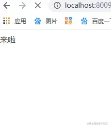

# 定长数据
响应头中有`content-length`表示数据的长度
```js
res.setHeader('Content-Length', 10);
res.write("helloworld");
```
如果设置的`Content-Length`大于实际内容长度，则浏览器无法显示

如果设置的`Content-Length`小于实际内容长度，则浏览器显示截取后的内容
例如
```js
res.setHeader('Content-Length', 8);
res.write("helloworld");


// 浏览器中显示
hellowor
```
# 不定长数据
响应头中添加`Transfer-Encoding: chunked`字段，会产生两个效果
+ Content-Length 字段会被忽略
+ 基于长连接持续推送动态内容
```js

const http = require('http');

const server = http.createServer();

server.on('request', (req, res) => {
  if(req.url === '/') {
    res.setHeader('Content-Type', 'text/html; charset=utf8');
    res.setHeader('Content-Length', 10);
    res.setHeader('Transfer-Encoding', 'chunked');
    res.write("<p>来啦</p>");
    setTimeout(() => {
      res.write("第一次传输<br/>");
    }, 1000);
    setTimeout(() => {
      res.write("第二次传输");
      res.end()
    }, 2000);
  }
})

server.listen(8009, () => {
  console.log("成功启动");
})
```


响应体的内容如下所示
```
chunk长度(16进制的数)
第一个chunk的内容
chunk长度(16进制的数)
第二个chunk的内容
......
0
```


